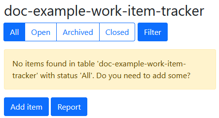
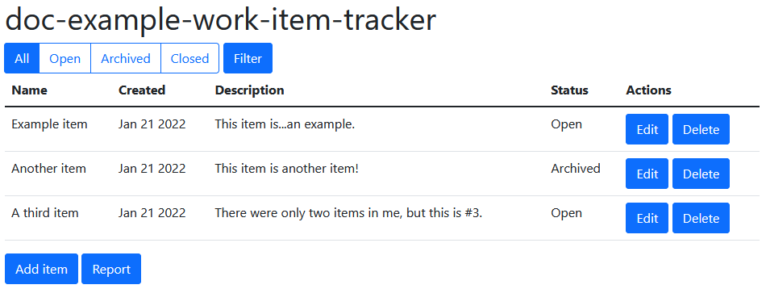

#  Amazon DynamoDB work item tracker web application

## Overview

| Item              | Description |
| ----------        | ----------- |
| Synopsis          | Shows how to create a web application that tracks work items and sends email reports. |
| SDK               | AWS SDK for Python (Boto3) |
| Difficulty        | Beginner |
| Required skills   | Python, Flask |

### AWS services demonstrated

* Amazon DynamoDB
* Amazon Simple Email Service (Amazon SES)
* AWS Identity and Access Management (IAM)

## Purpose

Shows how to use the AWS SDK for Python (Boto3) to create a web application that tracks 
work items in DynamoDB and emails reports by using Amazon SES.
This example uses the Flask web framework to host a local website and render
templated web pages.

* Integrate a Flask web application with AWS services.
* List, add, update, and delete items in a DynamoDB table.
* Send an email report of filtered work items using Amazon SES.
* Make AWS requests with an IAM role that restricts permissions.
* Deploy and manage example resources with the included AWS CloudFormation script.

## ⚠ Important

- As an AWS best practice, grant this code least privilege, or only the 
  permissions required to perform a task. For more information, see 
  [Grant Least Privilege](https://docs.aws.amazon.com/IAM/latest/UserGuide/best-practices.html#grant-least-privilege) 
  in the *AWS Identity and Access Management 
  User Guide*.
- This code has not been tested in all AWS Regions. Some AWS services are 
  available only in specific Regions. For more information, see the 
  [AWS Region Table](https://aws.amazon.com/about-aws/global-infrastructure/regional-product-services/)
  on the AWS website.
- Running this code might result in charges to your AWS account.

## Running the code

### Prerequisites

- You must have an AWS account, and have your default credentials and AWS Region
  configured as described in the [AWS Tools and SDKs Shared Configuration and
  Credentials Reference Guide](https://docs.aws.amazon.com/credref/latest/refdocs/creds-config-files.html).
- Python 3.8.8 or later
- Flask 2.0.2 or later
- Boto3 1.18.50 or later
- AWS CLI 2.1.12 or later (to set a role profile with these instructions)
- PyTest 6.0.2 or later (to run unit tests)
 
### Deploy resources

This example requires a DynamoDB table and an optional IAM role to restrict
permissions. You can use the `setup.yaml` CloudFormation script to create and
manage these resources, either by using the AWS Command Line Interface (AWS CLI) or 
the `setup.py` script. You can also manually deploy resources by using the AWS
Management Console.

The `setup.yaml` script was created by using the AWS Cloud Development Kit (AWS CDK)
script contained in the 
[resources/cdk/dynamodb-item-tracker](/resources/cdk/dynamodb-item-tracker)
folder.

#### CloudFormation deployment

1. Run `setup.py` with the `deploy` flag to create and deploy a CloudFormation stack 
that manages creation of a DynamoDB table and an IAM role that grants limited 
permissions needed by the app.
    ```
    python setup.py deploy
    ```
    The setup script outputs the name of the table and the Amazon Resource Name (ARN)
of the role.
    The setup script also creates a configuration file (`config.py`) used by the app.
    The default contents are similar to:
    ```python
    TABLE_NAME = 'doc-example-work-item-tracker'
    ```  
1. (Optional) If you want to run the app with restricted permissions instead of the
default user permissions, take the following steps:
    1. Use the [AWS CLI](https://docs.aws.amazon.com/cli/) 
    to create an assume role profile. In the following commands,
    replace the value of `role_arn` with the RoleArn from the setup script output, 
    replace the value of `source_profile` with the user profile you used to run the 
    setup script (the default is `default`), and replace the value of `region` with
    your AWS Region.
       ```
       aws configure set role_arn arn:aws:iam::111122223333:role/doc-example-work-item-tracker-role --profile item_tracker_role
       aws configure set source_profile default --profile item_tracker_role
       aws configure set region YOUR-AWS-REGION --profile item_tracker_role
       ``` 
    1. You can find the entry for this profile in your `~/.aws/config` file under the
    heading `[profile item_tracker_role]`. Or you can verify it with the AWS CLI.
       ```
       aws configure list --profile item_tracker_role
       ```
       The profile looks similar to:
       ```
       [profile item_tracker_role]
       role_arn = arn:aws:iam::111222333:role/doc-example-work-item-tracker-role
       source_profile = default
       region = us-west-2
       ``` 
    1. Add an 'ITEM_TRACKER_PROFILE' value to the `config.py` file created by the setup
    script.
       ```
       ITEM_TRACKER_PROFILE = 'item_tracker_role'
       ```  
**Note:** The example can be run with default permissions or with restricted 
permissions. When you run the app, it checks the `ITEM_TRACKER_PROFILE` value in 
`config.py`. If this entry exists, Boto3 is configured to use that profile to assume the 
specified role. The result is that Boto3 is granted restricted permissions instead of
the default user permissions, and the app is only able to make AWS requests that are 
allowed by the role.

#### Console deployment

If you prefer, you can deploy the resources for the application by using the 
[AWS Management Console](https://docs.aws.amazon.com/awsconsolehelpdocs/latest/gsg/learn-whats-new.html).
To deploy with the console, take the following steps:

1. Open the console in your browser.
1. Navigate to DynamoDB and create a table named `doc-example-work-item-tracker`
with a partition key of String type named `item_id`.

**Note:** With manual deployment, the app runs as the default user with full permissions.

#### Verify an email address

1. To email reports from the app, you must register at least one email address.
In a browser, navigate to the [Amazon SES console](https://console.aws.amazon.com/ses/).
1. If necessary, select your AWS Region.
1. Select **Verified identities**.
1. Select **Create identity**.
1. Select **Email address**.
1. Enter an email address you own.
1. Select **Create identity**.
1. You will receive an email from Amazon Web Services that contains instructions on how
to verify the email with Amazon SES. Follow the instructions in the email to complete
verification.

### Run the app

This example uses [Flask](https://flask.palletsprojects.com/en/2.0.x/) to host a local 
web server. With the web server running, you can browse to the app endpoint and use
the app to add and remove work items and send email reports.

1. Run the app at a command prompt to start the Flask web server.
   ```
   python app.py
   ```
   When the app starts, it logs whether it is using default credentials or 
   restricted credentials along with the URL where the app is hosted.
   ```
   INFO: Using credentials from restricted profile item_tracker_role.
   INFO:  * Running on http://127.0.0.1:5000/
   ```

1. Start a web browser and browse to the [app URL](http://127.0.0.1:5000/).

1. At first, the table is empty.

    

1. Select **Add item**, fill in the values, and select **Add** to add an item.

    

1. After you've added items, they're displayed in the table.

    

1. Select a filter, such as **Archived**, and select **Filter** to get and display
only items with the specified status.

    

1. Select **Report** to send an email of the displayed items.

    

1. Fill in the form with the email you verified during setup, edit the message text, 
and select **Send report** to send an email of the displayed work items.

1. You can also edit and delete items by selecting **Edit** and **Delete** for each 
item in the table in the main page. 

### Destroy

If you created the example resources by using the `setup.yaml` CloudFormation script,
you can destroy all resources in the same way, either by using the AWS CLI or the
`setup.py script`. If you created resources by using the console, you must manually
destroy them.

Run `setup.py` with the `destroy` flag to destroy the example resources and the
CloudFormation stack that manages them.
   ```
   python setup.py destroy
   ```

## Example structure

This example uses the Flask web framework to host a local website and render
templated web pages.

### Routing

The [app.py](app.py) file starts and configures the app and handles all website routing.

In this file, you can find functions decorated as Flask routes. For example:

```python
    @app.route('/')
    @app.route('/items')
    def items():
        ...
```  

The routes in the app do things like:

* Display a table of items.
* Display a form for adding a new item.
* Accept a POST that edits an item.
* Send an email report to a specified email address.

### Rendering

The routes serve web pages that are rendered by Flask from templates that are stored in
the `templates` folder, such as [items.html](templates/items.html), which displays the 
list of work items based on the specified filter.

The templates use flow control and variables contained in curly braces to render data 
returned from DynamoDB. For example, the work items table rows are rendered from 
this part of the `items.html` template:

```html

<tr>
  <td>{{item.name}}</td>
  <td>{{item.formatted_date}}</td>
  <td>{{item.description}}</td>
  <td>{{item.status}}</td>
  <td>
    <a class="btn btn-primary" href="/item/{{item.item_id}}">Edit</a>
    <a class="btn btn-primary" href="/items/delete/{{item.item_id}}">Delete</a>
  </td>
</tr>

```    

### DynamoDB storage

The [storage.py](storage.py) file contains functions that get and set data in DynamoDB. 
For example, this excerpt scans the table for work items with a specified status:

```python
work_items = self.table.scan(
    FilterExpression=Attr('status').eq(status_filter)).get('Items', [])
```

### Amazon SES report

The [report.py](report.py) file contains functions that send an email report of work items to
a specified email address. For example: 

```python
self.ses_client.send_email(
    Source=sender,
    Destination={'ToAddresses': [recipient]},
    Message={
        'Subject': {'Data': subject},
        'Body': {
            'Text': {'Data': text_message},
            'Html': {'Data': html_message}}})
``` 

## Running the tests

The unit tests in this module use the botocore Stubber, which captures requests before 
they are sent to AWS, and returns a mocked response. To run all of the tests, 
run the following in your [GitHub root]/python/cross_service/dynamodb_item_tracker
folder.

```    
python -m pytest
```

## Additional information

- [Boto3 DynamoDB service reference](https://boto3.amazonaws.com/v1/documentation/api/latest/reference/services/dynamodb.html)
- [Boto3 IAM service reference](https://boto3.amazonaws.com/v1/documentation/api/latest/reference/services/iam.html)
- [DynamoDB Documentation](https://docs.aws.amazon.com/dynamodb)
- [IAM Documentation](https://docs.aws.amazon.com/iam)

---
Copyright Amazon.com, Inc. or its affiliates. All Rights Reserved.

SPDX-License-Identifier: Apache-2.0
