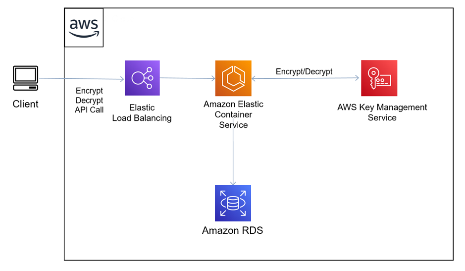
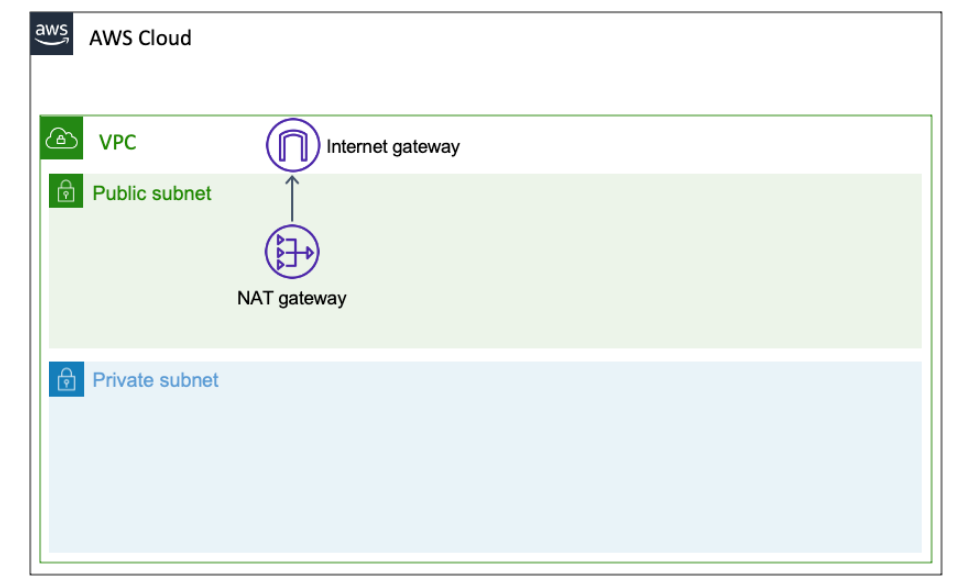

## SUPERVISIÓN AUTÓNOMA DE LA ACTIVIDAD CRIPTOGRÁFICA CON KMS

<br>



**[Link: LEVEL 300: AUTONOMOUS MONITORING OF CRYPTOGRAPHIC ACTIVITY WITH KMS](https://wellarchitectedlabs.com/security/300_labs/300_autonomous_monitoring_of_cryptographic_activity_with_kms/)**

### Introducción
La capacidad de proporcionar trazabilidad y reaccionar automáticamente a los eventos de seguridad que se producen en la carga de trabajo es vital para mantener una postura de alta seguridad dentro de la aplicación. Mediante el uso de métricas de actividad clave, los arquitectos pueden detectar comportamientos potencialmente maliciosos en una fase temprana y responder en función del evento. Combinando este enfoque de detección temprana con alertas adecuadas, podemos crear un bucle de retroalimentación autónomo que garantice que los administradores de la nube estén adecuadamente informados antes de que se produzca un evento grave.

En AWS se puede utilizar AWS CloudTrail para capturar toda la actividad basada en API dentro de una cuenta de AWS. Sin embargo, la simple captura de estas actividades no es suficiente sin la capacidad de contextualizar los eventos y crear el mecanismo para reaccionar automáticamente de forma adecuada. La integración de Amazon CloudWatch en combinación con CloudTrail y nuestros otros servicios, permite a los clientes producir alertas adecuadas y visibilidad a eventos importantes del sistema desencadenados por una métrica de actividad clave.

Un ejemplo de métrica de actividad clave sería la actividad del servicio de administración de claves (KMS). KMS forma parte integral de la mayoría de los diseños de arquitecturas seguras y es responsable de la actividad autónoma de cifrado y descifrado. Si bien cabe esperar una actividad regular que se desencadene como subproducto de la interacción del usuario con una arquitectura, una actividad significativamente alta podría ser una señal de alerta temprana de que la arquitectura podría ser objeto de una exfiltración de datos por parte de un tercero interesado o de la competencia.

### Lanzar la infraestructura base

En esta sección, construiremos una Virtual Public Cloud (VPC), junto con subredes públicas y privadas a través de dos Zonas de Disponibilidad, Internet Gateway y NAT gateway junto con las rutas necesarias desde ambas subredes públicas y privadas.

Esta VPC se convertirá en la arquitectura de red de referencia en la que se ejecutará la aplicación. Cuando completemos con éxito nuestro despliegue de plantilla inicial, nuestra carga de trabajo desplegada debería reflejar el siguiente diagrama:



Para crear la infrastructura base, ejecute lo siguiente en su shell:

```bash
sam build
sam deploy --guided
```

### CONFIGURAR EL REPOSITORIO ECS Y DESPLEGAR LA PILA DE APLICACIONES

En esta sección, vamos a preparar nuestra aplicación de ejemplo. Vamos a empaquetar esto como una imagen docker y empujar a un repositorio.

Como mencionamos en nuestra introducción, nuestra aplicación de ejemplo se ejecutará en un contenedor Docker que desplegaremos utilizando Amazon ECS.

Para preparar el despliegue, tendremos que empaquetar nuestra aplicación como una imagen Docker y enviarla a ECR. Una vez completado esto, utilizaremos la imagen que hemos colocado en ECR para construir nuestro clúster de aplicaciones.

Ejecute el siguiente comando:
```bash
cd ecs-step
unzip node_modules.zip
bash build-container.sh <<nombre de la plantilla cuando ejecuto sam>>
```
**NOTA: Tenga en cuenta el URI de imagen ECS que aparece al final del script, ya que lo necesitaremos más adelante.**

Ahora que hemos insertado la imagen Docker en nuestro repositorio de Amazon ECR, vamos a desplegarla en Amazon ECS.

Nuestra aplicación de ejemplo está configurada de la siguiente manera:

* Nuestra aplicación está construida usando nodejs express ( Puedes encontrar el código fuente en el archivo app/app.js del repositorio github )

* El servicio expondrá una API REST con las acciones /encrypt y /decrypt.

* El /encrypt tendrá una entrada de una carga JSON con clave y valor como por ejemplo: '{"Name": "Andy Jassy", "Text": "Welcome To ReInvent 2020!"}'.

* La clave del nombre será el identificador que utilizaremos para almacenar el valor cifrado del valor del texto.

* A continuación, la aplicación llamará a la API KMS Encrypt y lo cifrará de nuevo utilizando la clave KMS que designemos. (Para simplificar, en este simulacro de aplicación utilizaremos la misma clave KMS para cada nombre que introduzcamos, lo ideal sería utilizar una clave individual para cada nombre).

* El valor cifrado de la clave de texto se almacenará en una base de datos RDS, y la aplicación devolverá un valor de clave de cifrado que el usuario tendrá que pasar para descifrar el texto más tarde.

* La API de descifrado hará lo contrario, tomando la clave de cifrado que pases para descifrar el texto {"Text": "Welcome To ReInvent 2020!"}

Ejecute:
```bash
sam build --template-file ecs-template.yml
sam deploy --template-file ecs-template.yml --guided --capabilities CAPABILITY_IAM CAPABILITY_NAMED_IAM --config-file ecs-deploy.toml
```

Cuando se le pregunte por el parámetro **BaselineVpcStack** ingrese el nombre del stack de SAM que desplegó en la sección anterior.

### Prueba de la aplicación lanzada.
En esta parte del Laboratorio, probaremos la API de cifrado de la aplicación de ejemplo que acabamos de desplegar. Nuestra aplicación básicamente tomará una carga útil JSON con Nombre y Clave de texto, y cifrará el valor bajo la clave de texto con una clave KMS designada. Una vez que el texto es encriptado, almacenará el texto encriptado en la base de datos RDS con el Nombre como clave primaria.

**NOTA: Para simplificar, nuestra aplicación de ejemplo no genera claves KMS individuales para cada registro generado. Si desea implementar este patrón en producción, le recomendamos que utilice una clave KMS independiente para cada registro.**

Para probar la aplicación, ejecute lo siguiente en su shell:

```bash
ALBURL="< Application Endpoint URL >"
curl --header "Content-Type: application/json" --request POST --data '{"Name":"Andy Jassy","Text":"Welcome to ReInvent 2020!"}' $ALBURL/encrypt
```