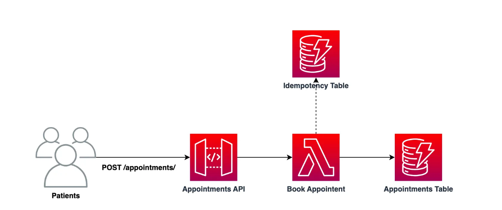

## Idempotencia sin servidor con Powertools para AWS Lambda

Para ayudar a explicar la solución, cubriremos una consulta médica ficticia llamada "L.J Doctors", donde los pacientes pueden hacer reservas en línea.

En la solución que se muestra a continuación, podemos ver que tenemos una API de **reservas** básica que tiene una integración de función de Lambda para la lógica empresarial, que en última instancia persiste las reservas en nuestra tabla de DynamoDB".

### [Link](https://blog.serverlessadvocate.com/serverless-idempotency-with-powertools-for-aws-lambda-8f6aa0b0e816)

### Idempotencia
El concepto de idempotencia garantiza que operar varias veces con los mismos parámetros de entrada no produce efectos secundarios adicionales. Las operaciones idempotentes producen sistemáticamente el mismo resultado tras múltiples llamadas exitosas, lo que las hace seguras para los reintentos.

La clave de idempotencia, un hash derivado de todo el evento o de un subconjunto específico configurado, encapsula los parámetros de entrada. Los resultados de las invocaciones se serializan en JSON y se almacenan en la capa de almacenamiento de persistencia elegida. En nuestro ejemplo, esta capa de persistencia es Amazon DynamoDB.
