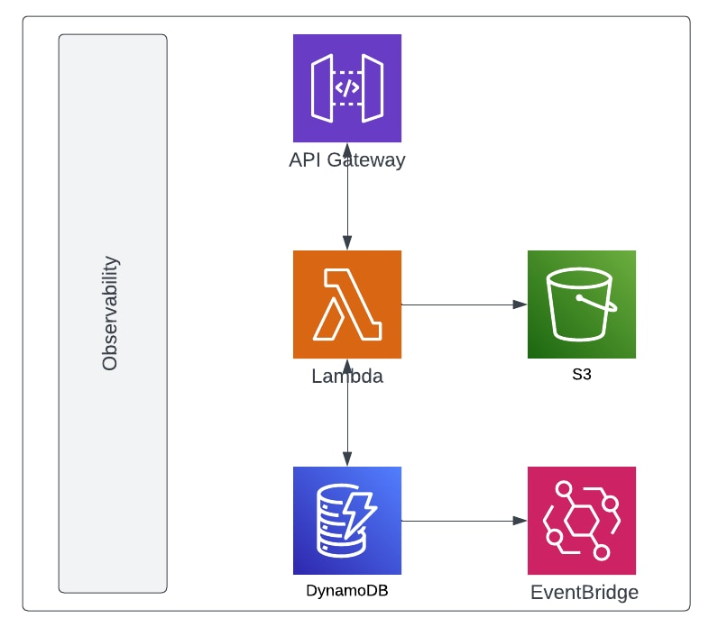

## Observabilidad
Construir aplicaciones Serverless puede parecer un poco abrumador cuando se está empezando. Por supuesto, los sistemas controlados por eventos han existido durante muchos años, pero esta noción de utilizar servicios administrados para "ensamblar" soluciones frente a una arquitectura de estilo "plugin" más tradicional podría desconcertarle.

### Qué es la observabilidad
La observabilidad es la capacidad de medir el estado de un sistema en un momento dado, comprender su rendimiento y comportamiento y proporcionar el nivel adecuado de visibilidad de cada operación en caso de que sea necesario inspeccionarla.

Sin la instrumentación adecuada, estará volando a ciegas, por así decirlo, en el sentido de que siempre estará respondiendo a los problemas y tratando de determinar lo que ha sucedido, en lugar de ser capaz de tener la información que necesita para tomar la decisión correcta.

`sam build`

`sam deploy -g --capabilities CAPABILITY_IAM CAPABILITY_NAMED_IAM`