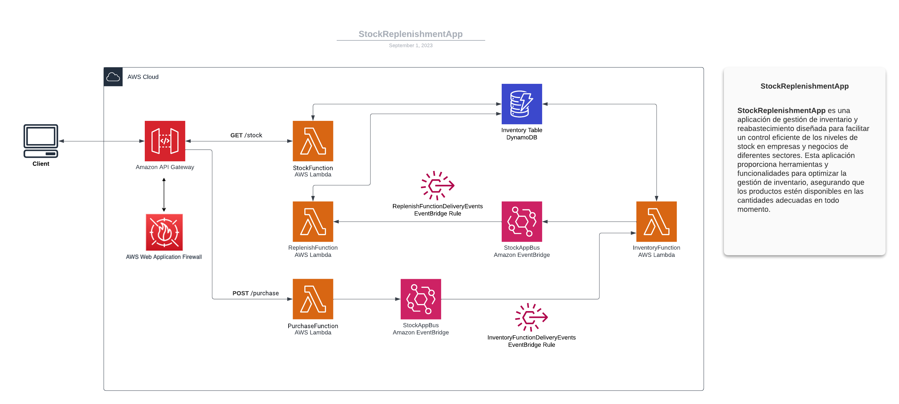

# StockReplenishmentApp

**StockReplenishmentApp** es una aplicación de gestión de inventario y reabastecimiento diseñada para facilitar un control eficiente de los niveles de stock en empresas y negocios de diferentes sectores. Esta aplicación proporciona herramientas y funcionalidades para optimizar la gestión de inventario, asegurando que los productos estén disponibles en las cantidades adecuadas en todo momento. A continuación, se presenta una descripción para la aplicación:

**Descripción de la StockReplenishmentApp:**

La StockReplenishmentApp es una solución integral para el control de inventario y la reposición de stock que brinda a las empresas el poder de gestionar sus recursos de manera eficaz y sin problemas. Diseñada para agilizar el proceso de reabastecimiento y minimizar los riesgos de escasez o exceso de inventario, esta aplicación ofrece una interfaz intuitiva y características avanzadas que permiten una gestión precisa y automatizada.

**Características Principales:**

1. **Seguimiento en Tiempo Real:** Mantén un registro preciso de las existencias actuales de cada producto. Visualiza las cantidades disponibles en tiempo real y recibe alertas cuando los niveles de stock se acerquen a los umbrales de reposición.

2. **Puntos de Reposición Personalizables:** Define umbrales de stock mínimos (ReplenishBelow) para cada producto de acuerdo a tu estrategia y demanda. La aplicación generará automáticamente solicitudes de reposición cuando las existencias caigan por debajo de estos puntos.

3. **Cálculos Inteligentes de Reabastecimiento:** Utiliza algoritmos inteligentes que consideran factores como la demanda histórica, el plazo de reorden y los tiempos de entrega para calcular la cantidad óptima de reposición (ReplenishAmount).

4. **Planificación de Pedidos:** Visualiza de manera clara y concisa cuándo y qué productos deben reponerse. Organiza los pedidos de reabastecimiento de manera eficiente para evitar retrasos y garantizar la disponibilidad constante de productos.

5. **Notificaciones y Alertas:** Recibe notificaciones instantáneas por correo electrónico o mensajes dentro de la aplicación cuando los niveles de stock alcancen los puntos de reposición. Mantente informado en todo momento para tomar decisiones oportunas.

6. **Análisis y Reportes:** Accede a informes detallados sobre el rendimiento del inventario, el histórico de reabastecimientos y otros indicadores clave. Utiliza estos datos para tomar decisiones estratégicas y ajustar tu enfoque de gestión de inventario.

7. **Integración con Proveedores:** Facilita la comunicación con proveedores al generar órdenes de compra automáticas o recomendaciones basadas en las necesidades de reabastecimiento.

La StockReplenishmentApp es la herramienta esencial para garantizar que tus operaciones comerciales nunca se vean afectadas por la falta de productos en stock. Optimiza tu gestión de inventario, minimiza costos y maximiza la satisfacción del cliente con esta aplicación intuitiva y completa.

### ReplenishAmount

La columna *ReplenishAmount* en una tabla de stock generalmente se refiere a la cantidad de productos o artículos que se deben reponer en el inventario para mantener un nivel deseado de existencias. Esta columna podría utilizarse en sistemas de gestión de inventario para determinar cuántos productos deben ser adquiridos o producidos para asegurarse de que haya suficiente disponibilidad para satisfacer la demanda de los clientes.

La lógica detrás de esta columna es gestionar de manera eficiente los niveles de stock. Cuando las existencias de un producto disminuyen por debajo de cierto umbral predefinido (punto de reposición), se inicia un proceso de reabastecimiento para traer el inventario de nuevo a un nivel óptimo. La columna "ReplenishAmount" indicaría la cantidad específica que se necesita para llevar a cabo esta reposición.

La fórmula para calcular el valor de "ReplenishAmount" podría depender de diversos factores, como la demanda histórica, el tiempo de entrega de los proveedores, el plazo de reorden, entre otros. Por lo tanto, esta columna es esencial en la planificación y gestión de inventario, ya que ayuda a asegurarse de que no haya escasez de productos ni exceso de inventario, lo que puede tener un impacto financiero en el negocio.

### ReplenishBelow
La columna "ReplenishBelow" en una tabla de stock generalmente se refiere a un umbral mínimo de existencias de un producto o artículo en el inventario. Esta columna se utiliza para determinar cuándo es necesario reponer el inventario de un producto específico.

Cuando las existencias de un producto caen por debajo del valor establecido en la columna "ReplenishBelow", esto indica que es hora de iniciar un proceso de reabastecimiento para evitar quedarse sin stock y poder satisfacer la demanda de los clientes de manera continua. En otras palabras, "ReplenishBelow" es el punto de referencia que activa el proceso de reorden y reposición de inventario.

Este enfoque ayuda a evitar situaciones de escasez, lo que podría resultar en pérdida de ventas o insatisfacción del cliente. La columna "ReplenishBelow" se utiliza en combinación con otras métricas y datos, como la velocidad de venta, el tiempo de entrega de los proveedores y la demanda prevista, para determinar cuándo y cuánto se debe reponer un producto en el inventario.

### Ejemplos

#### Crear elementos de ejemplos:
    
    python start.py

#### Ver total en stock de un producto:

    curl --location --request GET 'https://xxxxxxxxx.execute-api.us-east-1.amazonaws.com/Prod/stock' \
    --header 'Content-Type: application/json' \
    --data '{
        "Location": "57812",
        "SKU": "ItemZ"
    }'

#### Crear un pedido:

    curl --location 'https://xxxxxxxxx.execute-api.us-east-1.amazonaws.com/Prod/purchase' \
    --header 'Content-Type: application/json' \
    --data '{
        "Location": "90210",
        "SKU": "ItemX",
        "PurchaseCount": 3
    }'

