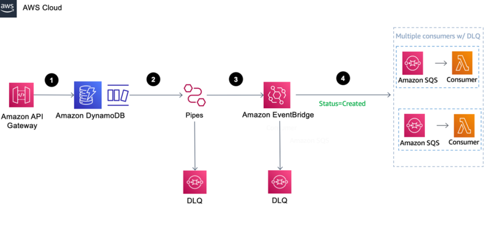

# Patrón de salida transaccional

La arquitectura de microservicios es un estilo arquitectónico que estructura una aplicación como una colección de servicios poco acoplados y desplegables de forma independiente. Los servicios deben comunicarse entre sí para intercambiar mensajes y realizar operaciones de negocio. Garantizar la fiabilidad de los mensajes a la vez que se mantiene un acoplamiento flexible entre los servicios es crucial para crear sistemas robustos y escalables.

Esta aplicación muestra cómo utilizar Amazon DynamoDB, una base de datos NoSQL de valores clave sin servidor totalmente administrada, y Amazon EventBridge, un bus de eventos sin servidor administrado, para implementar mensajería fiable para microservicios mediante el patrón de bandeja de salida transaccional.

Las operaciones empresariales pueden abarcar varios sistemas o bases de datos para mantener la coherencia y la sincronización entre ellos. Un enfoque utilizado a menudo en sistemas distribuidos o arquitecturas en las que los datos deben replicarse en varias ubicaciones o componentes es la escritura dual. En un escenario de escritura dual, cuando se realiza una operación de escritura en un sistema o base de datos, los mismos datos o eventos también se activan en otro sistema en tiempo real o casi real. Esto garantiza que ambos sistemas tengan siempre los mismos datos, minimizando las incoherencias de datos.

La doble escritura también puede plantear problemas de integridad de los datos en los sistemas distribuidos. Si no se actualiza la base de datos o no se envían eventos a otros sistemas posteriores tras una actualización inicial del sistema, se pueden perder datos y dejar la aplicación en un estado incoherente. Un enfoque de diseño para superar este reto es combinar escrituras duales con el patrón de salida transaccional.

1. En esta implementación de muestra, Amazon API Gateway realiza una llamada POST a la tabla de DynamoDB para actualizar la base de datos. Amazon API Gateway soporta operaciones CRUD para Amazon DynamoDB sin necesidad de una capa informática para las llamadas a la base de datos.

2. DynamoDB Streams está habilitado en la tabla, lo que captura una secuencia ordenada en el tiempo de las modificaciones a nivel de elemento en la tabla de DynamoDB casi en tiempo real.

3. EventBridge Pipes se integra con DynamoDB Streams para capturar los eventos y, opcionalmente, puede filtrar y enriquecer los datos antes de enviarlos a un destino compatible. En este ejemplo, los eventos se envían a Amazon EventBridge, que actúa como bus de mensajes. Esto puede sustituirse por cualquiera de los destinos soportados, tal y como se detalla en Destinos de Amazon EventBridge Pipes. DLQ puede configurarse para gestionar cualquier evento fallido, que puede analizarse y reintentarse.

4. Los consumidores que escuchan el bus de eventos reciben mensajes. Opcionalmente, puede distribuir y entregar los eventos a varios consumidores y aplicar filtros. Se puede configurar un DLQ para manejar cualquier fallo y reintentos.

### Pasos posteriores a la implementación
Después de la implementación, la URL del punto final de la puerta de enlace de API se puede recuperar de la sección Salidas de la pila de CloudFormation. Puede probar su punto final utilizando herramientas como curl o Postman.

### Detalles de la implementación
La pila implementada se basa en una arquitectura sin servidor, en la que API Gateway se utiliza para activar una operación de DynamoDB mediante una solicitud POST. El cambio en DynamoDB activa un EventBus de EventBridge a través de AWS Pipes. Este EventBus invoca la función de Lambda a través de una cola SQS cuando se ha creado un pedido.

### Pasos para SAM

`sam build`

`sam deploy -g --capabilities CAPABILITY_IAM`
